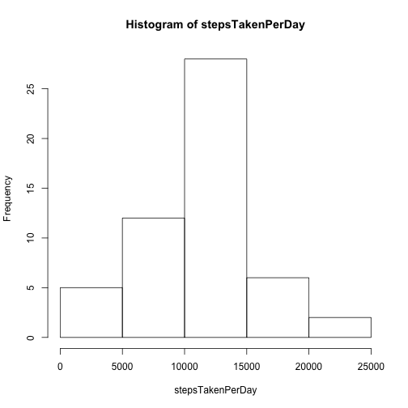
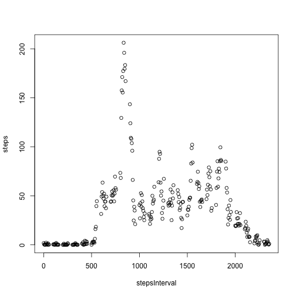
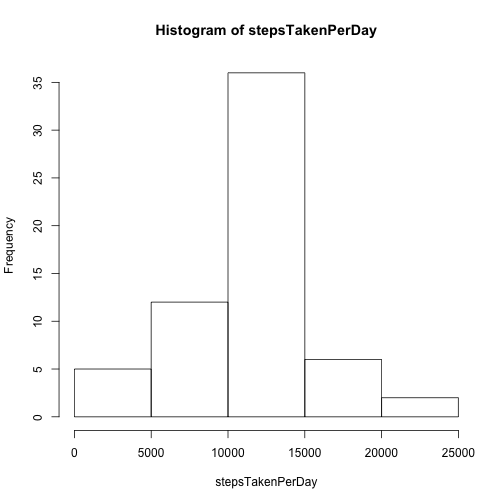
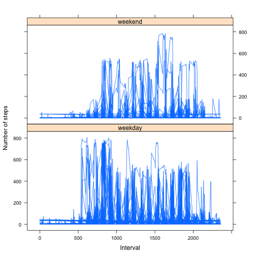

## Loading and preprocessing the data
extracting the activity zip file and reading the  file contents 

```r
unzip(zipfile = "activity.zip")
activityData <-read.csv("activity.csv",sep = ",")
```
Splitting the data by date - running on this on the data where NA's were ignored

```r
naOmittedData <-na.omit(activityData)
naOmittedData$date <- factor(naOmittedData$date)
splitNaOmmittedDataByDate <- split(naOmittedData,naOmittedData$date)
```
## What is mean total number of steps taken per day?
1.Calculating total number of steps taken per day.
  As mentioned in the requirement for this step, 
  ignored the missing values in the dataset while calculating this.
  i.e used the observed data only to calcuate this. 

```r
noOfStepsPerDay <- lapply(splitNaOmmittedDataByDate,function(x){sum(x["steps"])})
```
2.Histogram

```r
stepsTakenPerDay<-as.numeric(noOfStepsPerDay)
hist(stepsTakenPerDay)
```

 

3.Calculating mean and median

```r
mean(stepsTakenPerDay)
```

```
## [1] 10766.19
```

```r
median(stepsTakenPerDay)
```

```
## [1] 10765
```
## What is the average daily activity pattern?
1.time series plot of the 5minute interval and the average number of steps taken

```r
splitByIntervalData <- split(naOmittedData,naOmittedData$interval)
noOfStepsPerInterval <- lapply(splitByIntervalData,
                               function(x){sum(x["steps"])/nrow(x["steps"])}
                               )
stepsInterval<-as.numeric(names(noOfStepsPerInterval))
steps<-as.numeric(noOfStepsPerInterval)
df<-as.data.frame(m<-cbind(stepsInterval,steps))
plot(stepsInterval,steps)
```

 

2.The 5-minute interval that contains the maximum number of steps on average 
across all the days in the dataset

```r
tail(df[order(steps),],1)["stepsInterval"]
```

```
##     stepsInterval
## 104           835
```
## Imputing missing values
1.Missing Data in actual dataset 
Missing Data count in steps column

```r
sum(is.na(activityData$steps))
```

```
## [1] 2304
```
Missing Data count in date column

```r
sum(is.na(activityData$date))
```

```
## [1] 0
```
Missing Data count in interval column

```r
sum(is.na(activityData$interval))
```

```
## [1] 0
```
2.Strategy used to fill the missing values -
All the NA values in steps column were filled with 
average number of steps of all the observed/reported data of all the dates and intervals 
i.e with sum of all the steps for all days on all intervals ignoring the missing 
values divided by total number of observations.

Before filling in the values , mean and median of just the observed data 
ignoring the missing values were closer.
After filling in the missing values,mean and median became much closer 
- became the same.

This strategy is implemented in the Step 3 below.

3.Creating a new dataset that is equal to the original dataset but  the missing 
data filled is filled in the new dataset.

```r
cleanActivityData <- activityData
```
Calculating the mean of steps for all the observered dates data

```r
sum<-sum(naOmittedData["steps"])
length <- nrow(naOmittedData)
averageSteps <- sum/length
```
Replace all the steps - NA values with the average no of steps

```r
cleanActivityData$steps[is.na(cleanActivityData$steps)] <- averageSteps
```

4.Histogram

```r
splitDataByDate <- split(cleanActivityData,cleanActivityData$date)
noOfStepsPerDay <- lapply(splitDataByDate,function(x){sum(x["steps"])})
stepsTakenPerDay<-as.numeric(noOfStepsPerDay)
hist(stepsTakenPerDay)
```

 

Mean , Median calculation

```r
mean(stepsTakenPerDay)
```

```
## [1] 10766.19
```

```r
median(stepsTakenPerDay)
```

```
## [1] 10766.19
```

## Are there differences in activity patterns between weekdays and weekends?
1.new factor variable 

```r
cleanActivityData$day <- ifelse(
        weekdays(as.Date(cleanActivityData$date)) != "Saturday" & 
        weekdays(as.Date(cleanActivityData$date)) != "Sunday",
        "weekday", "weekend")
cleanActivityData$day<-as.factor(cleanActivityData$day)
```
2.panel plot containing a time series plot  of the 5-minute interval
and the average number of steps 

```r
library(lattice)
par(mfrow=c(2,1))
plot <- xyplot(steps~interval|day,data = cleanActivityData,xlab = "Interval",
               ylab = "Number of steps",type = "l",layout = c(1,2))
print(plot)
```

 
